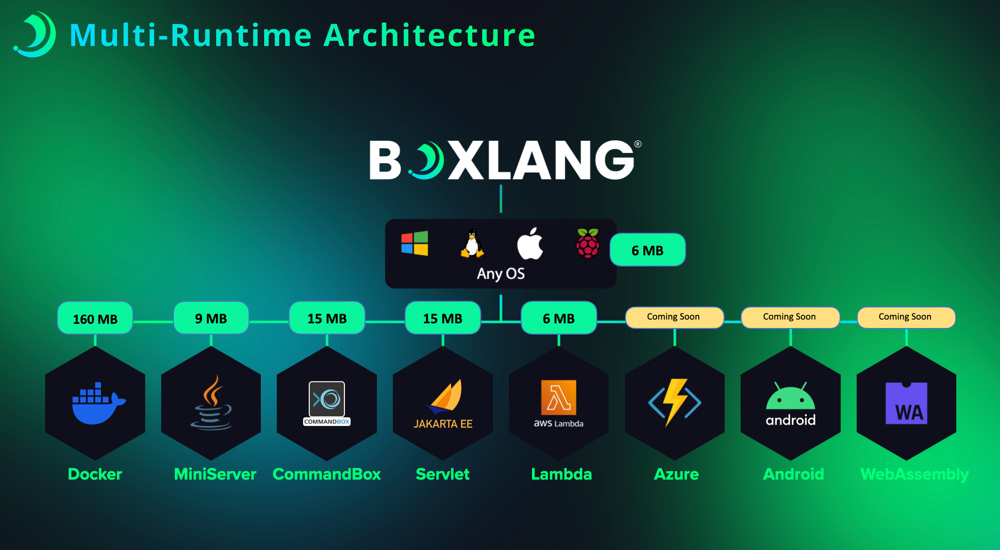

# BoxLang Workshop : Juego de Trivia

Bienvenidos al mundo de programacion con [BoxLang](https://www.boxlang.io).  Este repositorio contiene el taller de entrenamiento
dividido en varios pasos y nuestra aplicacion completada: **Juego de Trivia**, una aplicacion de trivia.

## Que es BoxLang?

BoxLang es un lenguaje de programacion **dinamico** que corre en el Java Virtual machine que permite a los estudiantes aprender los conceptos basicos de programacion de una manera facil y divertida.  BoxLang es similar a Groovy o Java, pero con una sintaxis mas simple y facil de entender.  BoxLang es un lenguaje de programacion de alto nivel que permite a los estudiantes aprender los conceptos basicos de programacion sin tener que preocuparse por la sintaxis complicada de otros lenguajes de programacion.  Tambien es un lenguaje con conceptos de programacion orientada a objetos y funcional.

Ademas BoxLang es un lenguaje `multi-runtime`, lo que significa que puede correr en diferentes entornos como en cualquier sistema operativo (Windows, Mac, Linux, *nix) y en diferentes dispositivos como en la terminal, en la web, docker, en dispositivos moviles, en aws lambda, raspberry pi, etc.

## Objetivo

En este taller estaremos empezando a programar con BoxLang una aplicacion de trivia que corre en la terminal o mas frequentemente llamado **CLI** (Command Line Interface).  A lo largo de este taller, aprenderemos los conceptos basicos de programacion y BoxLang.

- [Pre-Requisitos](PREREQUISITOS.md)
- [Outline](OUTLINE.md)
